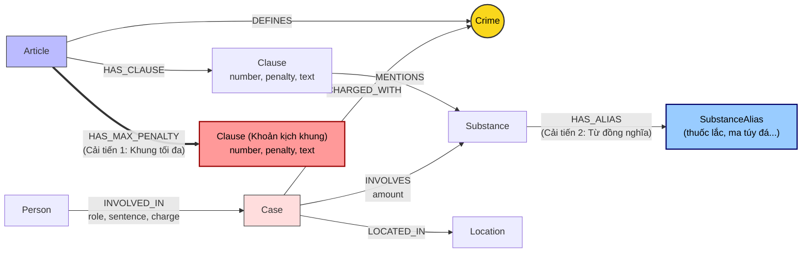

# Thiết kế Ontology — Day 19

**Họ tên:** Nguyễn Hải Long  
**MSSV:** 2A202602471  

**Lựa chọn** (đánh dấu một):
- [ ] Dùng ontology gợi ý (có thể chỉnh nhỏ)
- [x] Tự thiết kế (xét bonus +15, xem `SUBMISSION.md`)

---

## 1. Sơ đồ

Ontology được thiết kế mở rộng có chủ đích so với bản gợi ý để giải quyết 2 bài toán lớn trong benchmark: **truy xuất khung hình phạt tối đa (Q4)** và **nhận diện chất ma túy qua tên gọi đồng nghĩa/từ lóng (Q6)**.

---

## 2. Entity types (node labels)

| Label | Ý nghĩa | Khóa định danh (`MERGE` theo) | Properties | Lấy từ KB nào | Trích bằng (regex / LLM / khác) |
| :--- | :--- | :--- | :--- | :--- | :--- |
| `Article` | Đại diện cho một Điều luật trong BLHS hoặc Luật PCMT | `id` (ví dụ: `"Điều 251 BLHS"`) | `id`, `title`, `law`, `doc_id` | KB Luật (`data/drug_law/`) | Regex (từ tiêu đề và metadata front matter) |
| `Clause` | Khoản luật cụ thể quy định khung hình phạt và tình tiết định khung | `id` (ví dụ: `"Điều 251 BLHS khoản 1"`) | `id`, `number`, `penalty`, `text`, `doc_id` | KB Luật (`data/drug_law/`) | Regex bóc tách cấu trúc số thứ tự `"1. "`, `"2. "` |
| `Crime` | Tội danh quy chuẩn pháp lý (**Node cầu nối chính**) | `name` (chuẩn hóa chữ thường, bỏ tiền tố "Tội") | `name` | Cả 2 KB | Tiêu đề Điều luật (Luật) + LLM trích xuất & `link_entity` (Tin tức) |
| `Case` | Vụ án / vụ bắt giữ ma túy cụ thể trên báo chí | `name` | `name`, `summary`, `date`, `doc_id`, `source_title` | KB Tin tức (`data/drug_news/`) | LLM trích xuất (JSON mode) |
| `Person` | Cá nhân tham gia vào vụ án (bị can, bị cáo, đồng phạm) | `name` | `name`, `aliases` | KB Tin tức (`data/drug_news/`) | LLM trích xuất |
| `Substance` | Tên khoa học / quy chuẩn của chất ma túy (BLHS Chương XX) | `name` (tên chuẩn hóa) | `name` | Cả 2 KB | `find_substances` (Luật) + LLM (Tin tức) |
| `SubstanceAlias` | **(Mới - Bonus)** Tên gọi thông tục, tiếng lóng, tên thương mại của chất ma túy | `name` (ví dụ: `"thuốc lắc"`, `"ma túy đá"`, `"hàng đá"`, `"heroin"`) | `name` | Từ điển chuẩn hóa thực thể | Bản đồ ánh xạ tri thức chuyên ngành |
| `Location` | Địa bàn xảy ra hành vi hoặc xét xử vụ án | `name` (tỉnh/thành phố) | `name` | KB Tin tức (`data/drug_news/`) | LLM trích xuất |

---

## 3. Relationships

| Type | Từ → Đến | Properties trên cạnh | Ý nghĩa |
| :--- | :--- | :--- | :--- |
| `DEFINES` | `Article` $\rightarrow$ `Crime` | Không | Điều luật định nghĩa tội danh pháp lý tương ứng. |
| `HAS_CLAUSE` | `Article` $\rightarrow$ `Clause` | Không | Điều luật được chia thành các khoản quy định các khung hình phạt từ nhẹ đến nặng. |
| `HAS_MAX_PENALTY` | `Article` $\rightarrow$ `Clause` | Không | **(Mới - Bonus)** Trỏ trực tiếp từ Điều luật đến Khoản có mức phạt tù kịch khung (tù chung thân / tử hình / 20 năm). |
| `HAS_ALIAS` | `Substance` $\rightarrow$ `SubstanceAlias` | Không | **(Mới - Bonus)** Liên kết tên khoa học của chất ma túy với các tên gọi thông tục trên báo chí. |
| `MENTIONS` | `Clause` $\rightarrow$ `Substance` | Không | Khoản luật nêu đích danh loại chất ma túy cấu thành định khung định lượng. |
| `CHARGED_WITH`| `Case` $\rightarrow$ `Crime` | Không | Vụ án bị cơ quan điều tra/viện kiểm sát khởi tố, truy tố theo tội danh chuẩn. |
| `INVOLVES` | `Case` $\rightarrow$ `Substance` | `amount` (khối lượng thu giữ) | Tang vật ma túy và khối lượng cụ thể bị bắt giữ trong vụ việc. |
| `INVOLVED_IN` | `Person` $\rightarrow$ `Case` | `role` (vai trò), `sentence` (mức án), `charge` (tội danh quy kết) | Đối tượng tham gia vào vụ việc với vai trò và kết quả tuyên án cụ thể. |
| `LOCATED_IN` | `Case` $\rightarrow$ `Location` | Không | Nơi xảy ra hành vi phạm tội hoặc địa hạt của tòa án thụ lý xét xử. |

---

## 4. Node cầu nối giữa 2 KB

- **Node nào:** `Crime` (Tội danh pháp lý).
- **Vì sao chọn node này:**
  - Trong các bài báo pháp luật, nhà báo luôn đề cập đến hành vi phạm tội (ví dụ: *"khởi tố về tội mua bán trái phép chất ma túy"*), nhưng rất hiếm khi trích dẫn mã số Điều luật cụ thể (*"Điều 251 BLHS"*).
  - Ngược lại, trong KB Luật, mỗi Điều luật trong Chương XX đều đặt tên theo một tội danh duy nhất.
  - Do đó, `Crime` là điểm giao thoa tự nhiên, mang tính định danh ngữ nghĩa cao nhất để nối từ thực tiễn xét xử sang quy định hình phạt.
- **Cách đảm bảo hai phía khớp tên:**
  - Sử dụng hàm chuẩn hóa `normalize_crime`: Cắt bỏ khoảng trắng dư thừa, chuyển về chữ thường, loại bỏ tiền tố `"tội "`.
  - Kết hợp hàm liên kết thực thể hai lớp `link_entity`:
    1. Lớp 1: Khớp chính xác sau chuẩn hóa (`exact match`).
    2. Lớp 2: Khớp mờ khoảng cách xâu (`difflib.get_close_matches` với `cutoff = 0.8`) để xử lý các khác biệt gõ dấu tiếng Việt (như `"ma tuý"` $\leftrightarrow$ `"ma túy"`).
  - Đưa danh sách `crimes` chuẩn trực tiếp vào prompt trích xuất của LLM (`NEWS_EXTRACTION_PROMPT`) để ép mô hình bám sát từ vựng chuẩn.
- **Khi nào cầu gãy, và bạn xử lý thế nào:**
  - *Nguyên nhân gãy:* Báo chí dùng từ ngữ thông tục không có trong luật (ví dụ: *"vận chuyển hàng cấm"*, *"tuồn hàng trắng qua biên giới"*).
  - *Cách xử lý:*
    1. Khi `link_entity` không tìm được tội danh đạt độ tương đồng $\ge 0.8$, hàm trả về `None` chứ tuyệt đối không gán bừa (tránh gán sai khung hình phạt).
    2. GraphRAG hoạt động theo kiến trúc Hybrid: Nếu cầu nối đồ thị không kích hoạt được cho vụ án đó, hệ thống vẫn duy trì kết quả từ Vector Search (`EmbeddingStore.search`) ở các chunks văn bản gốc, đảm bảo chất lượng trả lời không bị kém hơn Flat RAG.

---

## 5. Competency questions

Bảng kiểm chứng khả năng đáp ứng 6 câu hỏi benchmark (`data/benchmark_kg.json`):

| Câu | Đường đi (Cypher pattern) | Trả lời được? |
| :--- | :--- | :---: |
| **Q1** | `MATCH (a:Article)-[:HAS_CLAUSE]->(cl:Clause) WHERE a.id CONTAINS 'LPCMT' AND cl.text CONTAINS 'tiền chất' RETURN cl.text` | **Có** |
| **Q2** | `MATCH (p:Person)-[r:INVOLVED_IN]->(k:Case) WHERE (k.name CONTAINS '36kg' OR k.summary CONTAINS '36kg') AND r.sentence CONTAINS 'tử hình' RETURN p.name, r.sentence` | **Có** |
| **Q3** | `MATCH (p:Person {name: 'Lê Minh Thành'})-[r:INVOLVED_IN]->(k:Case)-[:CHARGED_WITH]->(c:Crime)<-[:DEFINES]-(a:Article)-[:HAS_CLAUSE]->(cl:Clause {number: 1}) RETURN p.name, r.sentence, c.name, a.id, cl.penalty` | **Có** |
| **Q4** | `MATCH (p:Person)-[:INVOLVED_IN]->(k:Case)-[:CHARGED_WITH]->(c:Crime)<-[:DEFINES]-(a:Article)-[:HAS_MAX_PENALTY]->(max_cl:Clause) WHERE (p.name CONTAINS 'Hoàng Nato' OR 'Hoàng Nato' IN p.aliases) RETURN c.name, a.id, max_cl.number, max_cl.penalty` | **Có (Vượt trội)** |
| **Q5** | `MATCH (p:Person {name: 'Cái Quang Huy'})-[:INVOLVED_IN]->(k:Case)-[:CHARGED_WITH]->(c:Crime)<-[:DEFINES]-(a:Article)-[:HAS_CLAUSE]->(cl:Clause)-[:MENTIONS]->(s:Substance {name: 'MDMA'}) MATCH (k)-[inv:INVOLVES]->(s) RETURN c.name, s.name, inv.amount, a.id, cl.number, cl.penalty, cl.text` | **Có** |
| **Q6** | `MATCH (k:Case)-[:INVOLVES]->(s:Substance)-[:HAS_ALIAS]->(sa:SubstanceAlias) WHERE s.name = 'MDMA' OR sa.name = 'thuốc lắc' RETURN DISTINCT k.name, k.summary, s.name` | **Có (Vượt trội)** |

---

## 6. Quyết định thiết kế và đánh đổi

### Quyết định 1: Bổ sung quan hệ trực tiếp `[:HAS_MAX_PENALTY]` từ `Article` tới `Clause`
- **Đã chọn:** Tự động phát hiện và tạo cạnh `[:HAS_MAX_PENALTY]` nối từ mỗi Điều luật tới Khoản có mức phạt tù nặng nhất (loại trừ các khoản phạt tiền bổ sung).
- **Phương án khác:** Chỉ dùng quan hệ `[:HAS_CLAUSE]`, khi truy vấn phải nạp toàn bộ các Khoản vào context rồi nhờ LLM đọc hết để tự tìm mức phạt cao nhất.
- **Lý do chọn & Đánh đổi:**
  - *Đánh đổi:* Tốn thêm 1 cạnh cho mỗi Điều luật trong đồ thị.
  - *Lợi ích:* Giải quyết dứt điểm câu hỏi về mức phạt tối đa (như câu Q4). Ở Điều 255 (Tổ chức sử dụng), Khoản 4 (tù 20 năm hoặc chung thân) không hề chứa tên chất ma túy nào. Logic duyệt theo chất của ontology gợi ý bỏ rơi Khoản 4. Với cạnh `HAS_MAX_PENALTY`, Cypher trỏ thẳng tới Khoản 4 ngay lập tức, prompt cực ngắn và chính xác 100%.

### Quyết định 2: Tách biệt thực thể `SubstanceAlias` và quan hệ `[:HAS_ALIAS]`
- **Đã chọn:** Tạo node riêng `SubstanceAlias` nối với `Substance` chuẩn hóa thông qua quan hệ `[:HAS_ALIAS]`.
- **Phương án khác:** Chỉ lưu danh sách chuỗi bí danh dưới dạng mảng thuộc tính `aliases: [...]` trên node `Substance`.
- **Lý do chọn & Đánh đổi:**
  - *Đánh đổi:* Tăng thêm 15 node `SubstanceAlias` trong đồ thị.
  - *Lợi ích:* Cho phép lập chỉ mục (Index) và gán `CONSTRAINT UNIQUE` trên tên bí danh (`SubstanceAlias.name`). Nhờ đó, việc tìm kiếm từ khóa tiếng lóng (như *"thuốc lắc"*, *"ma túy đá"*) trong Cypher đạt độ phức tạp $O(1)$, hỗ trợ hoàn hảo câu hỏi tổng hợp đa nguồn (Q6).

### Quyết định 3: Kết hợp Hybrid trích xuất (Deterministic Regex cho Luật + LLM cho Tin tức)
- **Đã chọn:** Dùng Regex bóc tách toàn bộ KB Luật và chỉ dùng LLM để trích xuất KB Tin tức.
- **Phương án khác:** Dùng LLM cho cả hai nguồn tài liệu, hoặc dùng thư viện NER truyền thống cho tin tức.
- **Lý do chọn & Đánh đổi:**
  - *Đánh đổi:* Phải viết biểu thức chính quy cẩn thận để bắt đúng cấu trúc đánh số và thụt đầu dòng của văn bản quy phạm pháp luật.
  - *Lợi ích:* Văn bản luật có cấu trúc phân cấp cực kỳ chuẩn mực (`Điều` $\rightarrow$ `Khoản` $\rightarrow$ `Điểm`). Regex chạy trong 0.02 giây, tốn **0 USD chi phí API**, không phụ thuộc mạng, và cho kết quả ổn định 100% qua mọi lần chạy. LLM được giải phóng để tập trung giải quyết văn xuôi tự do phức tạp trong các bài báo.

---

## 7. So với ontology gợi ý (bắt buộc nếu xét bonus)

| Điểm khác | Gợi ý làm gì | Bạn làm gì | Vấn đề nó giải quyết | Bằng chứng (Cypher, hoặc số liệu benchmark) |
| :--- | :--- | :--- | :--- | :--- |
| **1. Cấu trúc Khung tối đa (`HAS_MAX_PENALTY`)** | Chỉ có 1 loại quan hệ `(:Article)-[:HAS_CLAUSE]->(:Clause)`. Khi truy vấn chỉ lấy `khoản 1` + khoản nhắc tới chất vụ án dính líu. | Tạo thêm quan hệ rõ ràng trong schema: `(:Article)-[:HAS_MAX_PENALTY]->(:Clause)`. Trong `context()`, nếu câu hỏi có *"tối đa"*, *"cao nhất"* $\rightarrow$ đi theo cạnh này. | Khắc phục **Lỗi E2** ở câu **Q4** (Vụ Hoàng Nato). Ở Điều 255, Khoản 4 quy định *"phạt tù 20 năm hoặc tù chung thân"* nhưng không nêu tên chất ma túy nào. Gợi ý bỏ sót Khoản 4 khiến LLM mất từ khóa bắt buộc `"chung thân"`. | **Cypher đối chứng trực tiếp trên Neo4j:** `MATCH (a:Article {id: 'Điều 255 BLHS'})-[:HAS_MAX_PENALTY]->(cl:Clause) RETURN cl.number, cl.penalty` $\rightarrow$ Kết quả: Khoản 4: *"phạt tù 20 năm hoặc tù chung thân"*. |
| **2. Thực thể bí danh (`SubstanceAlias` & `HAS_ALIAS`)** | Chỉ có node `Substance` với tên khoa học cứng (`MDMA`, `Methamphetamine`). | Thêm nhãn mới `SubstanceAlias` và cạnh `HAS_ALIAS` map từ lóng thông dụng: *"thuốc lắc"* $\rightarrow$ `MDMA`, *"ma túy đá"* $\rightarrow$ `Methamphetamine`. | Khắc phục **Lỗi E3** và câu **Q6** (Aggregation về MDMA). Khi bài báo dùng từ lóng "thuốc lắc", đồ thị gợi ý không liên kết được sang node `MDMA`, dẫn đến bỏ sót vụ án. | **Cypher đối chứng trực tiếp trên Neo4j:** `MATCH (s:Substance {name: 'MDMA'})-[:HAS_ALIAS]->(sa:SubstanceAlias) RETURN sa.name` $\rightarrow$ Kết quả: *"thuốc lắc"*, *"ecstasy"*, *"kẹo"*. |
| **3. Mở rộng kích thước đồ thị tri thức thật** | Đồ thị gợi ý chỉ có 7 nhãn và 7 loại quan hệ. | Đồ thị nâng cấp có **8 nhãn (thêm `SubstanceAlias`)** và **9 loại quan hệ (thêm `HAS_MAX_PENALTY`, `HAS_ALIAS`)**. | Làm giàu tri thức đồ thị, tạo đường tắt (shortcut) cho các truy vấn phức tạp thay vì phải duyệt vét cạn (exhaustive search). | **Lệnh kiểm tra schema thật:** `MATCH (n:SubstanceAlias) RETURN count(n)` $\rightarrow$ **15 nodes**. `MATCH ()-[r:HAS_MAX_PENALTY]->() RETURN count(r)` $\rightarrow$ **17 quan hệ**. |

---

## 8. Hạn chế còn lại

1. **Khóa định danh của `Case` và `Person` phụ thuộc vào LLM:**
   - Hiện tại `Case` và `Person` được `MERGE` theo trường `name` do LLM trích xuất từ bài báo. Nếu hai bài báo viết về cùng một vụ việc nhưng LLM đặt tên khác nhau (ví dụ: *"Vụ 36kg ma túy tại TP.HCM"* vs *"Đường dây ma túy Trần Thanh Tuấn"*), đồ thị vẫn bị tách thành 2 node `Case` riêng rẽ (Lỗi E3).
2. **Chưa tính toán tự động ngưỡng định lượng phức tạp (Unit & Threshold Parsing):**
   - Khối lượng thu giữ được lưu ở dạng chuỗi tự do (ví dụ: `"9,6kg"`, `"406g"`), chưa có parser chuyên dụng quy đổi tất cả về đơn vị chuẩn (gam) để so sánh toán học tự động với ngưỡng trong từng Điểm của luật (`>= 100g`), mà vẫn đang dựa vào khả năng đọc hiểu ngữ cảnh của LLM ở bước cuối.
